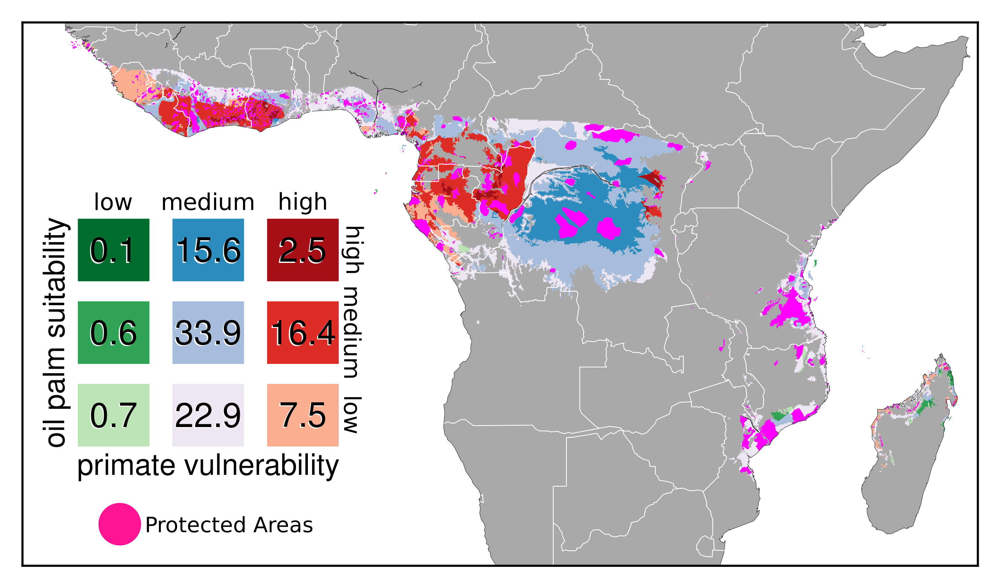

# oil-palm-primates

This repository includes the Python and R code associated to the following paper:

**Strona G., S. D. Stringer, G. Vieilledent, Z. Szantoi, J. Garcia-Ulloa, S. Wich.** Small room for compromise between oil palm cultivation and primate conservation in Africa. 

## Description

The code permits the full replication of all the analyses in the paper, as well as the reproduction of all figures (including the supplementary one). Analyses and map plotting are performed by the Python script `script_oil_palm_primates.py`, while the R code in `make_plots.R` permits the reproduction
of the other graphs. Note that the R code is called by the Python script, so the execution of the latter is enough for complete analysis replication.

## Input data

All the raw input files necessary to run the analyses can be downloaded from Zenodo \[DOI: [10.5281/zenodo.1200255](https://doi.org/10.5281/zenodo.1200255)\].

It is important that all the input files (which are provided in a single compressed zipped archive named INPUT_DATA.zip) are left in their relative position within their folder once this one is unzipped, and that both `script_oil_palm_primates.py` and `make_plots.R` are copied in that same folder.
At that point, running (from within the folder) the `script_oil_palm_primates.py` will perform all the analyses and generate all the output files. 

## Output data

All the expected output can be downloaded from Zenodo \[DOI: [10.5281/zenodo.1200265](https://doi.org/10.5281/zenodo.1200265)\].

## Versioning and archiving on Zenodo

The development version of this repository is available on GitHub at https://github.com/giovannistrona/oil-palm-primates. All versions of this repository, including the last release, are archived on Zenodo: \[DOI: [10.5281/zenodo.1200339](https://doi.org/10.5281/zenodo.1200339)\].

## Figure

**Figure 2:**  Spatial overlap between oil palm suitability and primate vulnerability, mapped at 1 km2 resolution. Numbers in the legend indicate the proportion of each class relative to the total suitable land.
